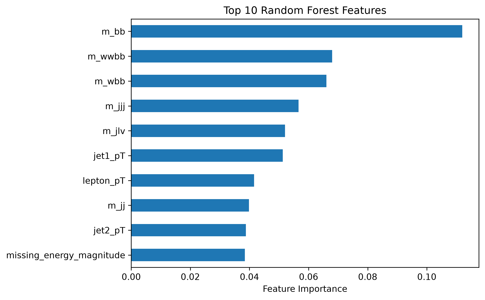

# Classification of Higgs Particle Collisions using Machine Learning

## Overview

This project investigates how effectively machine-learning models can distinguish simulated Higgs signal events from background events using a public HIGGS dataset.

The main research question is:

> **How much does physics-informed feature engineering improve machine-learning classification performance?**

The project compares linear and nonlinear classification models and examines the effect of high-level physics-derived features.

---

## Dataset

The project uses a subset of a public dataset containing simulated particle-physics events.

Each event contains:

* **1 target variable**: signal (1) or background (0)
* **28 physics features**
* Low-level kinematic and detector-related variables
* High-level reconstructed physics quantities such as invariant masses

The analysis uses **200,000 events** from the dataset.

The original HIGGS dataset was introduced by Baldi et al. for studying machine-learning approaches to particle-physics event classification.

---

## Methodology

### 1. Exploratory Data Analysis

The project begins by examining:

* Feature distributions
* Signal/background class balance
* Feature correlations
* Differences in feature distributions between signal and background

### 2. Baseline: Logistic Regression

Logistic regression was used as a simple linear baseline.

The model achieved:

| Metric    | Score |
| --------- | ----: |
| Accuracy  | 0.641 |
| Precision | 0.639 |
| Recall    | 0.737 |
| ROC-AUC   | 0.683 |

### 3. Random Forest

A Random Forest classifier was then used to capture nonlinear relationships and interactions between features.

Results:

| Metric    |     Score |
| --------- | --------: |
| Accuracy  |     0.724 |
| Precision |     0.733 |
| Recall    |     0.750 |
| ROC-AUC   | **0.802** |

The substantial improvement over logistic regression demonstrates that nonlinear relationships between the physics variables contain useful predictive information.

### 4. Neural Network

A feed-forward neural network was also evaluated using two hidden layers.

Results:

| Metric    |     Score |
| --------- | --------: |
| Accuracy  |     0.729 |
| Precision |     0.748 |
| Recall    |     0.735 |
| ROC-AUC   | **0.807** |

The neural network slightly outperformed the Random Forest, but the improvement was small compared with the gain obtained by moving from the linear baseline to nonlinear models.

---

## Physics-Informed Feature Engineering

A central experiment compared Random Forest performance using:

1. **Low-level features only**
2. **All 28 features**, including high-level reconstructed physics variables

### Results


Adding the high-level physics-derived features increased ROC-AUC by approximately **0.10**.

This demonstrates that the representation of the physics information supplied to the model has a substantial effect on classification performance.

---

## Model Comparison


The main performance improvement comes from moving from a linear model to nonlinear models. The neural network provides only a marginal improvement over the Random Forest.


---

## Feature Importance

Random Forest feature importance is used to identify which variables contribute most strongly to the model's predictions.



This provides an interpretable connection between the machine-learning results and the underlying physics, while recognising that correlated features can affect impurity-based importance measures.

---

## Key Findings

* Nonlinear models substantially outperform the logistic-regression baseline.
* The Random Forest achieves an ROC-AUC of **0.802**.
* The neural network achieves a slightly higher ROC-AUC of **0.807**.
* High-level physics-derived features substantially improve classification performance.
* Feature representation can be more important than simply increasing model complexity.

---

## Limitations

* The analysis uses simulated rather than experimental collision data.
* Only a subset of the full HIGGS dataset is used.
* Model performance depends on the chosen train/test split and hyperparameters.
* Random Forest feature importance does not necessarily imply causal importance.
* The results should therefore be interpreted as a machine-learning study rather than a measurement of Higgs-boson properties.

---

## Tools

* Python
* NumPy
* pandas
* Matplotlib
* scikit-learn
* Jupyter Notebook

## Project Structure

```text
higgs-ml/
├── data/
├── figures/
├── notebooks/
│   ├── 01_data_exploration.ipynb
│   ├── 02_baseline_model.ipynb
│   ├── 03_random_forest.ipynb
│   └── 04_neural_network.ipynb
├── src/
├── .gitignore
└── README.md
```

